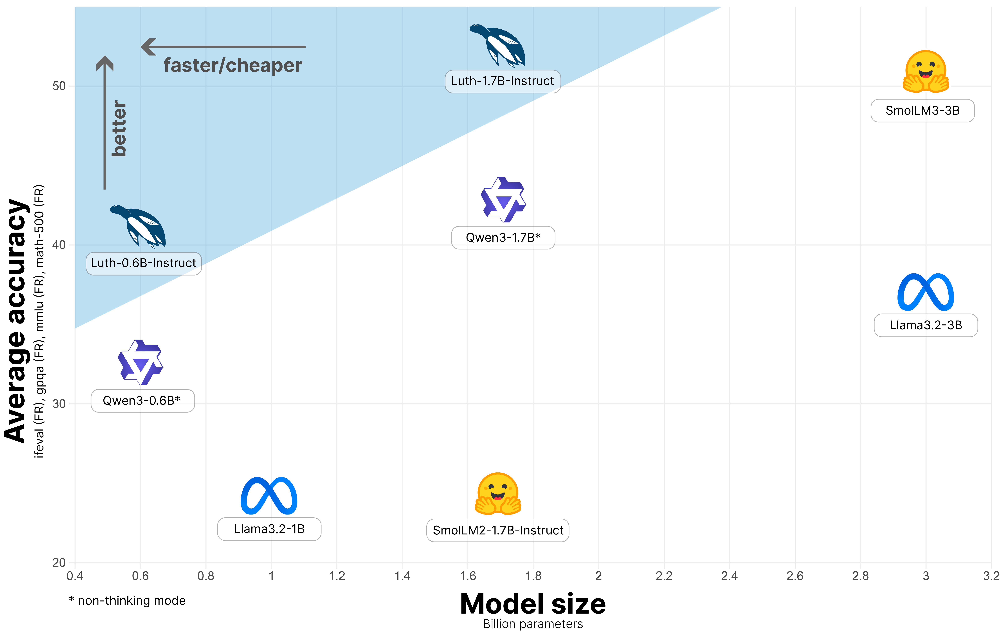
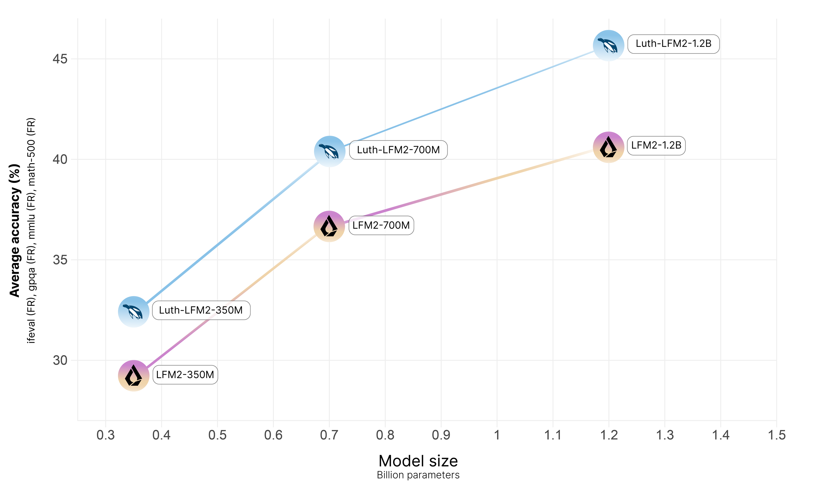

# Luth: Efficient French Specialization for Small Language Models

<div align="center">
  
</div>
<br style="line-height: 12px;" />
<div align="center" style="line-height: 1;">
  <a href="https://huggingface.co/collections/kurakurai/luth-models-68d1645498905a2091887a71" target="_blank" style="margin: 2px;">
    
  </a>
  <a href="https://huggingface.co/collections/kurakurai/luth-datasets-6881f936cad0a68de7a21044" target="_blank" style="margin: 2px;">
    
  </a>
  <a href="https://huggingface.co/blog/MaxLSB/luth" target="_blank" style="margin: 2px;">
  
</a>

</div>


## Introduction

**Luth** is a series of French fine-tuned versions of Qwen3 and LFM2 models, trained via supervised fine-tuning (SFT) on the [Luth-SFT](https://huggingface.co/datasets/kurakurai/luth-sft) dataset with Axolotl, followed by model merging with the original Qwen3 instruct models. The goal is to deliver improved **French instruction-following, math, and general knowledge** capabilities while preserving; and in some cases enhancing; English performance thanks to knowledge transfert. This project aims to provide better models for low-resource languages like French, optimized for low-resource hardware setups, and to contribute high-quality French datasets to the Hugging Face ecosystem, where such resources remain scarce. This repository contains the training, evaluation, and data scripts used to build Luth models: [Luth-0.6B-Instruct](https://huggingface.co/kurakurai/Luth-0.6B-Instruct), [Luth-1.7B-Instruct](https://huggingface.co/kurakurai/Luth-1.7B-Instruct), [Luth-LFM2-350M](https://huggingface.co/kurakurai/Luth-LFM2-350M), [Luth-LFM2-700M](https://huggingface.co/kurakurai/Luth-LFM2-700M) and [Luth-LFM2-1.2B](https://huggingface.co/kurakurai/Luth-LFM2-1.2B).





## 1. Quick Setup

_Using [`uv`](https://github.com/astral-sh/uv) for fast and reliable dependency management._

```bash
# Basic environment setup
make env        # Set up environment for evaluation, mergekit, etc. (excluding training)
make env-train  # Set up environment with training dependencies
make clean      # Delete all .venv
```
That's it, you can now run any command you want!

## 2. Evaluation

Many custom French evals are supported, check `configs/eval/all_fr_tasks.txt`.

You can modify the evaluation configuration in the `eval_config.yaml` file. Also **don't forget** to set your `HF_TOKEN`.
```bash
# To run the CLI commands
make env
source .venv/bin/activate
python src/eval/eval.py --config 'configs/eval/eval_config.yaml'
```

| Task        | Make Command       | Equivalent CLI Command                                                                                                                                               | Default Values                                                                 |
|-------------|--------------------|----------------------------------------------------------------------------------------------------------------------------------------------------------------------|----------------------------------------------------------------------------------|
| Evaluation French Benchmarks   | `make eval`       | `python src/eval/eval.py --config EVAL_CONFIG`                                                                                 | `EVAL_CONFIG=configs/eval/eval_config.yaml`                     |

⚠️ We use [LightEval](https://github.com/huggingface/lighteval) and [vLLM](https://github.com/vllm-project/vllm) for evaluation.

## 3. Training

You can modify the training configuration in the `sft_config.yaml` file. To enable multi-GPU training, prefix the `make` command with `CUDA_VISIBLE_DEVICES=0,1`.

```bash
# To run the CLI commands
make env-train
source .venv-train/bin/activate
accelerate launch src/train/sft.py --config 'configs/train/sft_config.yaml'
```

| Task        | Make Command       | Equivalent CLI Command                                                                                                                                               | Default Values                                                                 |
|-------------|--------------------|----------------------------------------------------------------------------------------------------------------------------------------------------------------------|----------------------------------------------------------------------------------|
| Run SFT   | `make sft`       | `accelerate launch src/train/sft.py --config SFT_CONFIG`                                                                                 | `SFT_CONFIG=configs/train/sft_config.yaml`                     |

⚠️ We use [Axolotl](https://github.com/axolotl-ai-cloud/axolotl) for training. Includes support for Flash Attention.

## 4. Model Merging

We use [Mergekit](https://github.com/arcee-ai/mergekit/) for model merging.

```bash
# To run model merging
make env
source .venv/bin/activate
mergekit-yaml configs/mergekit/merge_linear.yaml ./merged-output --cuda
```

## Citation

We are currently working on a paper!
```bibtex
@misc{luth2025kurakurai,
  title   = {Luth},
  author  = {Maxence Lasbordes, Sinoué Gad},
  year    = {2025},
  howpublished = {\url{https://github.com/kurakurai/Luth}},
}
```
